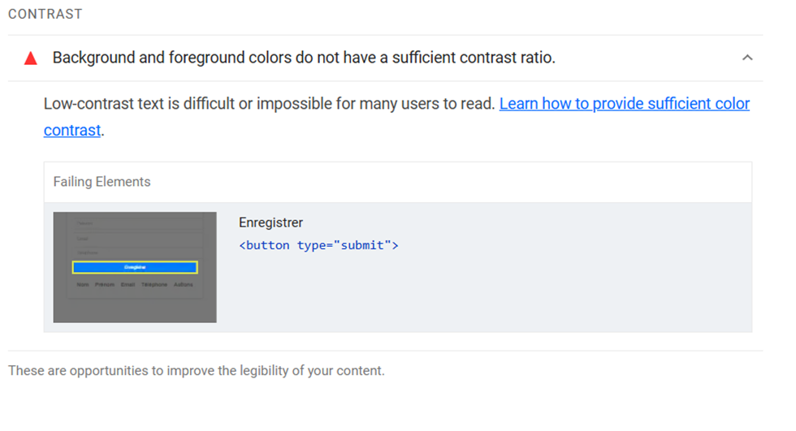
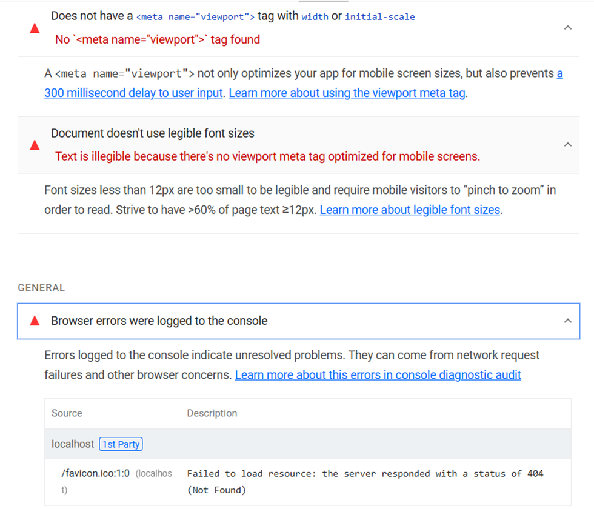
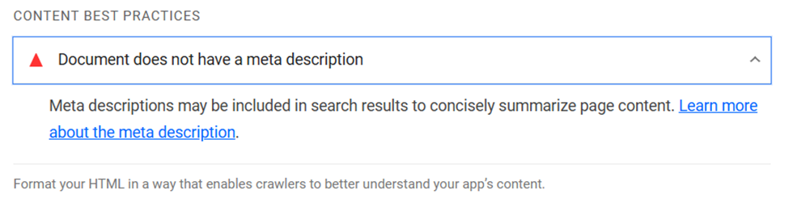

    Resultat Lighthouse :

Performance  :100
Accessibilité :90
Bonne pratiques : 89
SEO : 90

    Probleme :
 

     Solution :
j’aurais changer la couleur de fond pour le mettre un peu plus foncée , car du bleu claire sur du blanc peut être difficile a lire pour les gens avec des troubles de visons.

    Problèmes :

    Solution : 
Rajouter le tag nécessaire
Agrandir la police de mon text a 6-18 px

    Problèmes :
 

    Solution : 

rajouter le tag nécessaire.